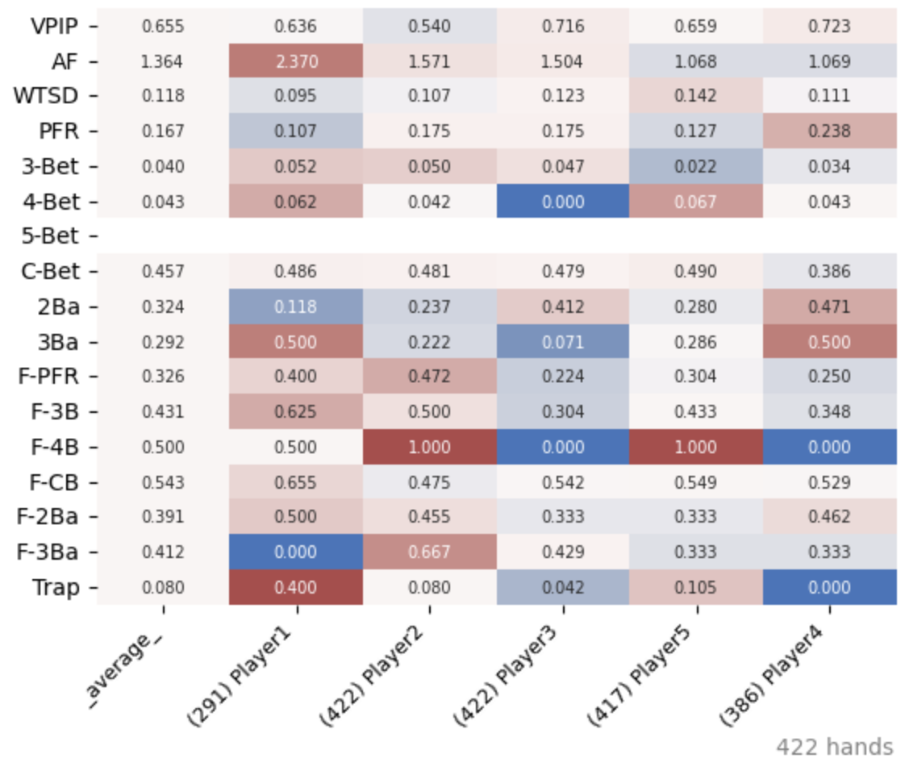
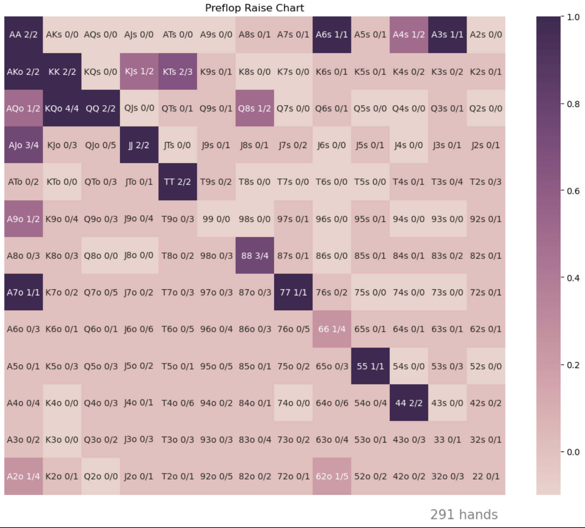
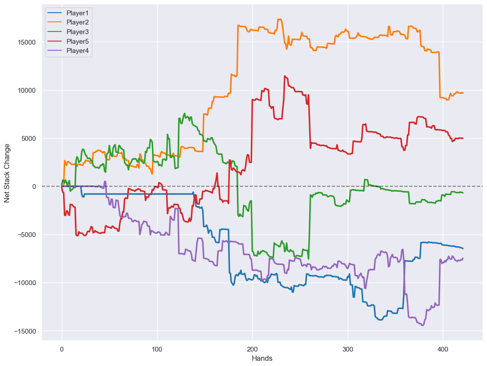
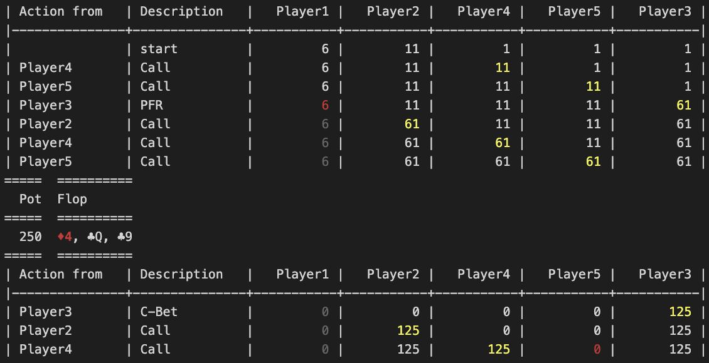
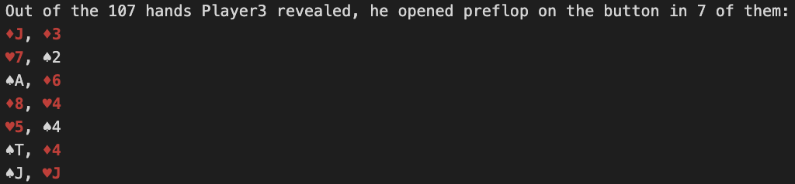

# PNParser

A log history parser to analyze poker strategies, hand histories, player statistics, preflop charts and much more, using the csv log file generated from [pokernow.club](https://pokernow.club/).

## Features

- ### Analyze player statistics
<p align="center">
  
</p>

- ### Plot player action chart (e.g. preflop open chart)
<p align="center">
  
</p>

- ### Plot accumulated player winnings
<p align="center">
  
</p>

- ### Replay hand history in stdout
<p align="center">
  
</p>

- ### Analyze opponents
<p align="center">
  
</p>

#### See `main.ipynb` for demonstration

| **Metrics** | **Definition** |
| :--: | :-- |
| VPIP | % of hands player voluntarily bet, raised or called preflop |
| PFR | % of hands player raised preflop |
| AF | (Bet + Raises) / Calls postflop |
| WTSD | % of hands player got to showndown given that they entered flop |
| 3-Bet | % of hands player raised when facing a PFR |
| 4-Bet | % of hands player raised when facing a 3-Bet |
| 5-Bet | % of hands player raised when facing a 4-Bet |
| C-Bet | % of hands player continuation bet given they are the preflop aggressor |
| 2-Ba | % of hands player double-barrel given they did continuation bet |
| 3-Ba | % of hands player triple-barrel given they double-barreled |
| F-PFR | % of hands player folded when facing a preflop raise |
| F-3B | % of hands player folded when facing a 3-Bet |
| F-4B | % of hands player folded when facing a 4-Bet |
| F-CB | % of hands player folded when facing a countinuation bet |
| F-2Ba| % of hands player folded when facing a double-barrel |
| F-3Ba | % of hands player folded when facing a triple-barrel |
| Trap | Raises / Calls when given the oppotunity to check-raise |

## Installation

1. Make sure Python >= 3.8 is installed

2. Download the code by pressing "<> Code" on the top right -> "Download ZIP" and uncompress at desired direcotory (or if you have git: `git clone https://github.com/foster-chen/PNParser.git`)

3. Open the system terminal and navigate to the root directory by typing the command below, substitute with your actual directory
```bash
cd \your\directory\PNParser
```

4. Install the dependencies:
```bash
python -m pip install -r requirements.txt
```
